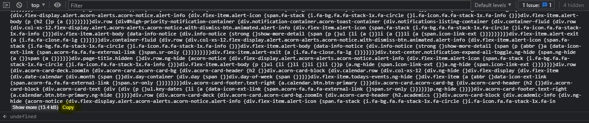

# Scripts for scraping
## Requirements
- These scripts have been tested for Google Chrome's inspect element console.
- Visual Studio Code's with the Format Document function.
## How to use the [scraper.js](scraper.js)
1) Copy the script and paste it into Chrome's inspect element's console.
2) Run the script and copy its output into an empty `.scss` file.
3) Press `CTRL + SHIFT + P` on VS Code and format the document.

Note: Make sure to copy the entire contents of the console's output.
